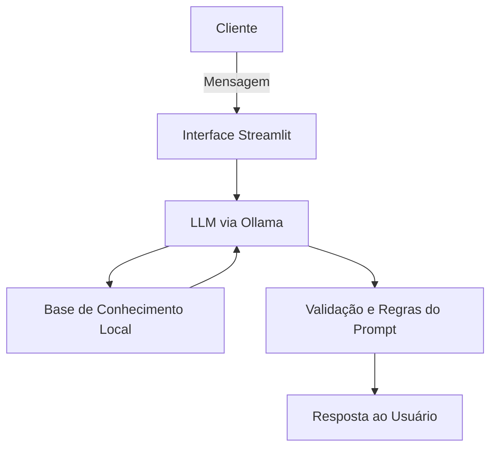

# Documentação do Agente

## Caso de Uso

### Problema
> Qual problema financeiro seu agente resolve?

Muitas pessoas possuem dificuldades para compreender conceitos financeiros básicos, realizar cálculos financeiros corretamente e interpretar informações relacionadas a investimentos e planejamento financeiro. Além disso, é comum que usuários tenham acesso a conteúdos financeiros complexos ou genéricos, que não consideram seus dados individuais ou contexto pessoal.

Outro problema recorrente é a falta de ferramentas confiáveis e acessíveis que permitam simular cenários financeiros com precisão matemática, como cálculos de juros simples, juros compostos e projeções de crescimento patrimonial.

---

### Solução
> Como o agente resolve esse problema de forma proativa?

O agente **FIN (Finanças Inteligentes)** atua como um assistente virtual de educação financeira e cálculo financeiro, oferecendo:

- Explicações claras e acessíveis sobre conceitos financeiros  
- Execução de cálculos financeiros com precisão matemática  
- Simulações financeiras baseadas exclusivamente nos dados fornecidos pelo usuário  
- Orientação educativa sem oferecer recomendações de investimento  
- Comunicação acolhedora e profissional  

O agente também mantém o contexto da conversa e utiliza dados estruturados do cliente para fornecer respostas mais relevantes e personalizadas.

---

### Público-Alvo
> Quem vai usar esse agente?

- Pessoas que desejam aprender educação financeira básica e intermediária  
- Usuários que precisam realizar cálculos financeiros com precisão  
- Clientes bancários que buscam compreender melhor seus dados financeiros  
- Estudantes e profissionais que desejam simular cenários financeiros  
- Usuários que preferem suporte automatizado para dúvidas financeiras  

---

## Persona e Tom de Voz

### Nome do Agente
**FIN — Finanças Inteligentes**

---

### Personalidade
> Como o agente se comporta? (ex: consultivo, direto, educativo)

O FIN possui uma personalidade:

- Educativa e orientadora  
- Analítica e precisa  
- Acolhedora e paciente  
- Transparente e ética  

O agente prioriza a clareza das informações, evitando termos excessivamente técnicos sem explicação, e mantém foco em educação financeira e cálculos objetivos.

---

### Tom de Comunicação
> Formal, informal, técnico, acessível?

O tom de comunicação do FIN é:

- Profissional e acessível  
- Educativo e explicativo  
- Cordial e encorajador  
- Claro e objetivo  

O agente evita linguagem excessivamente informal e mantém postura confiável e institucional.

---

### Exemplos de Linguagem

**Saudação:**  
"Olá! Sou o FIN, seu assistente de educação financeira. Como posso ajudar você hoje?"

**Confirmação:**  
"Entendi sua solicitação. Vou analisar as informações e realizar o cálculo para você."

**Erro/Limitação:**  
"Não possuo informações suficientes para realizar esse cálculo. Você poderia informar os dados necessários?"

---

## Arquitetura

### Diagrama

| Componente           | Descrição                                                                                         |
| -------------------- | ------------------------------------------------------------------------------------------------- |
| Interface            | Chatbot interativo desenvolvido em Streamlit                                                      |
| LLM                  | Modelo de linguagem executado localmente via Ollama (ex: Llama 3.1 8B)                            |
| Base de Conhecimento | Arquivos JSON e CSV contendo dados do cliente, histórico e produtos financeiros                   |
| Validação            | Regras implementadas via System Prompt para evitar alucinações e garantir conformidade financeira |

---

## Segurança e Anti-Alucinação

### Estratégias Adotadas

- [x] Agente responde apenas com base nos dados fornecidos pelo usuário e na base local
- [x] Prompt estruturado com regras explícitas de não invenção de dados
- [x] Declaração explícita quando informações são insuficientes
- [x] Proibição de recomendações de investimento
- [x] Minimização do uso de dados sensíveis
- [x] Bloqueio de solicitações relacionadas a credenciais ou acessos financeiros

### Limitações Declaradas
> O que o agente NÃO faz?

- [x]  Recomendações de investimento
- [x]  Previsões de mercado financeiro
- [x]  Consultoria jurídica ou contábil
- [x]  Acesso a dados bancários reais ou sistemas externos
- [x]  Coleta ou armazenamento permanente de dados sensíveis
- [x]  Atualização automática de indicadores econômicos em tempo real
- [x]  Execução de transações financeiras
